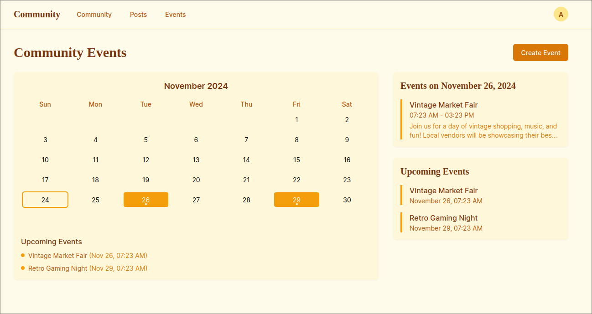
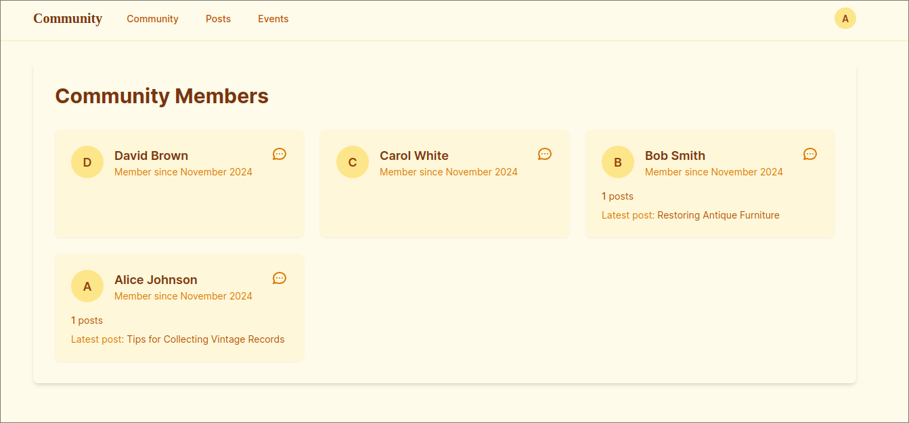
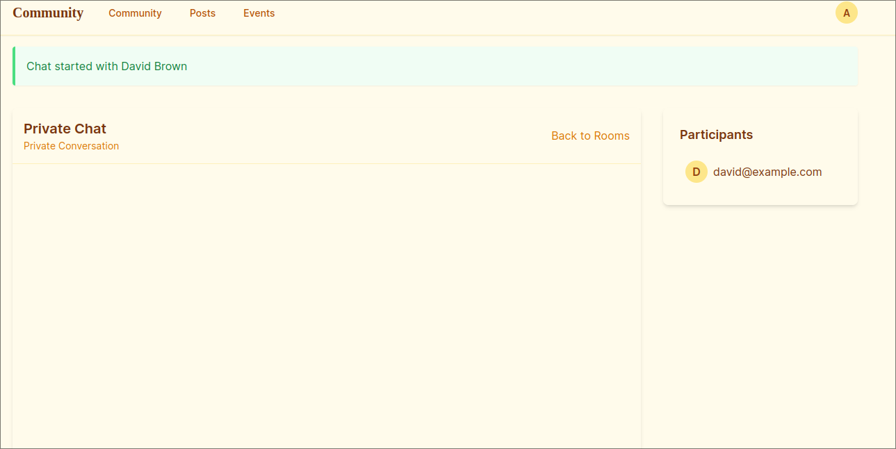
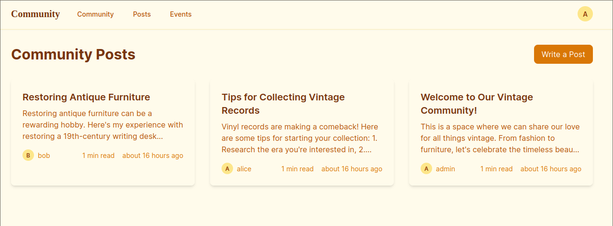

# Vintage Community Platform

A beautiful, vintage-themed community platform built with Ruby on Rails. This application features a paper-textured design with an amber color palette, creating a warm and nostalgic atmosphere for users to connect and share their love for all things vintage.

## Features




### User Management
- Authentication with Devise
- Role-based authorization (Admin, Member)
- User profiles with avatars
- Account settings and preferences

### Community Features
- Public posts with rich text content
- Event calendar with upcoming events
- Real-time chat rooms (public and private)
- Comments on posts and events
- Community member directory

### Design
- Vintage paper texture theme
- Amber color palette
- Responsive design for all devices
- Modern UI with a retro feel
- Accessibility-focused implementation

## Technology Stack

- Ruby 3.3.5
- Rails 7.1.2
- SQLite3
- Tailwind CSS
- Hotwire (Turbo & Stimulus)
- Action Cable for real-time features

## Getting Started

### Prerequisites
- Ruby 3.3.5
- Node.js and Yarn
- SQLite3

### Installation

1. Clone the repository:
```bash
git clone [repository-url]
cd chat
```

2. Install dependencies:
```bash
bundle install
yarn install
```

3. Setup the database:
```bash
rails db:setup
```

4. Start the server:
```bash
rails server
```

5. Visit http://localhost:3000 in your browser

### Demo Accounts

The following accounts are available for testing:

- Admin:
  - Email: admin@example.com
  - Password: password123

- Regular Users:
  - alice@example.com / password123
  - bob@example.com / password123
  - carol@example.com / password123
  - david@example.com / password123

## Features in Detail

### Posts
- Create and publish posts
- Rich text editor for content
- Comments and discussions
- Post management (edit, delete, publish/unpublish)

### Events
- Create and manage events
- Calendar view with navigation
- Event details with location and time
- Comments and RSVP functionality
- Upcoming and past event filters

### Chat System
- Public chat rooms for community discussions
- Private messaging between users
- Real-time updates
- Message history
- User presence indicators

### Comments
- Add comments to posts and events
- Real-time updates using Hotwire
- Markdown support
- Comment moderation for admins

## Contributing

1. Fork the repository
2. Create your feature branch (`git checkout -b feature/amazing-feature`)
3. Commit your changes (`git commit -m 'Add some amazing feature'`)
4. Push to the branch (`git push origin feature/amazing-feature`)
5. Open a Pull Request

## License

This project is licensed under the MIT License - see the LICENSE.md file for details

## Acknowledgments

- Design inspired by vintage paper and classic typography
- Built with modern web technologies while maintaining a retro aesthetic
- Community-focused features for vintage enthusiasts
